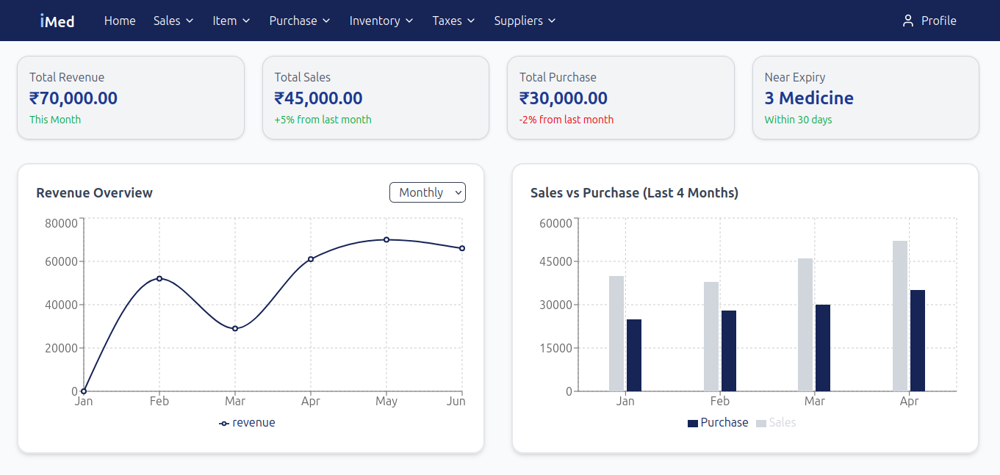
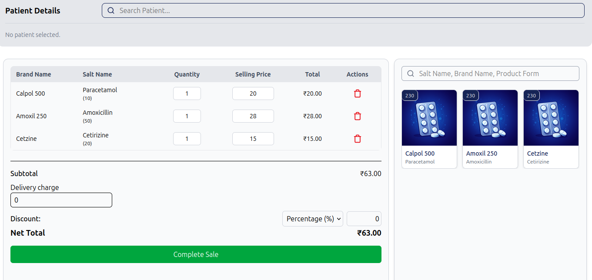
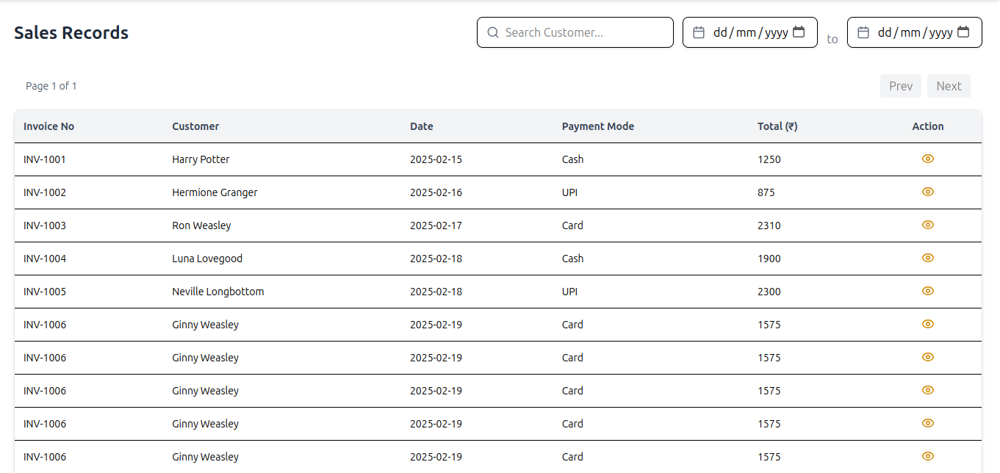

# iMed - Pharmacy Management System

iMed is a **desktop pharmacy management application** built using **ReactJS**, **TailwindCSS**, and **Electron**. It uses **SQLite** as an offline, file-based database. The application is designed for pharmacies to manage purchases, sales, inventory, suppliers, and taxes efficiently while working completely offline.

⚠️ Notice: This repository is for **educational/personal use only**. Commercial use is prohibited. See LICENSE for details.

## 📸 Screenshots

### 


### Add Sales


### Get Sales



## Features

- **User Authentication**
  - Register and Login for pharmacy users
- **Purchase Management**
  - Add new purchases
  - View all purchases
  - Return purchases
- **Sales Management**
  - Add new sales
  - View all sales
  - Return sales
- **Inventory Management**
  - Track medicines in stock
  - Monitor nearly expiring and expired medicines
- **Supplier Management**
  - Manage supplier information
- **Tax Handling**
  - Handle different types of taxes for sales and purchases
- **Dashboard**
  - Displays nearly expiring medicines
  - Shows expired medicines
  - Revenue overview (monthly and yearly)
- **Offline Functionality**
  - Fully functional offline using SQLite database

## Tech Stack

- **Frontend:** ReactJS, TailwindCSS  
- **Desktop App:** Electron  
- **Database:** SQLite (file-based, offline storage)


## 👨‍💻 Contributors
- **Developer:** [Mohammed Hassan](https://www.linkedin.com/in/mohammed-hassan-343b00215)

## 📥 Installation and Setup 
### open terminal and run the command
```sh
npm install
```
Step 2: Start development server of electron
```sh
npm run dev
```
